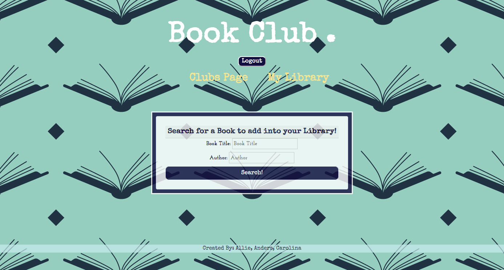

# Book Club

### Powered By 
    
        

## Description 

Make a profile and search for the books you're reading so everyone can check out what you read and find new novels. Join a club to keep in touch with other user's novel choices!

## Table of Contents
* [Usage](#Usage)
* [Credits](#Credits)
* [License](#License)
* [Questions](#Questions)

## Usage

## Credits

* Allie Watkins
* Anders Ackerman
* Carolina Cabrera

## License

Book Club is licensed under the MIT license.

## Questions

If anybody has any questions please reach out to the creators of the project - Anders Ackerman, Allie Watkins, and Carolina Cabrera via:
* Emails: 
  - anders.swedishviking@gmail.com
  - carolinaccez@gmail.com
  - allielynne20@gmail.com
* GitHubs: 
  - https://github.com/dj-viking
  - https://github.com/carolinacez
  - https://github.com/allielynne20
